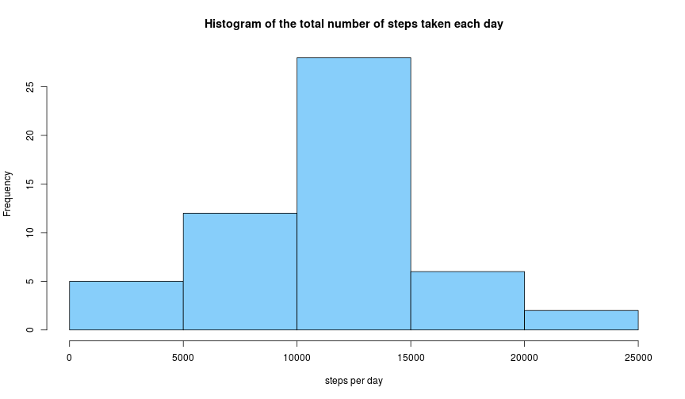
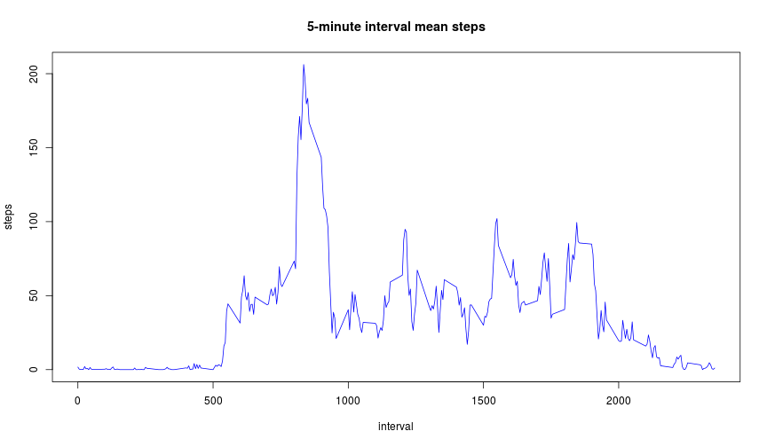
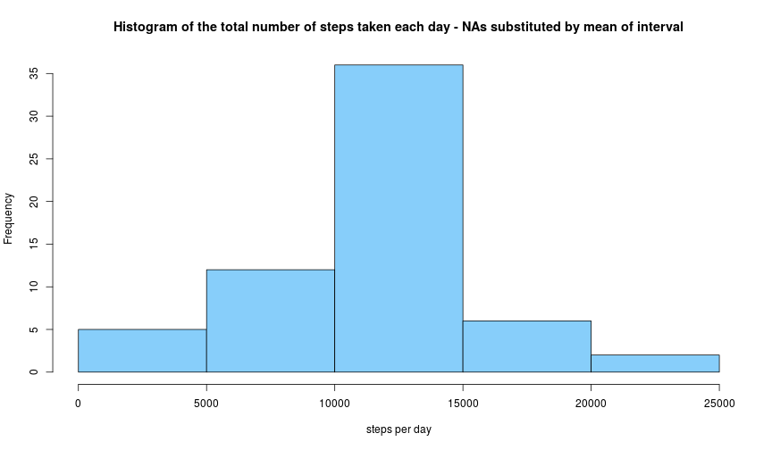
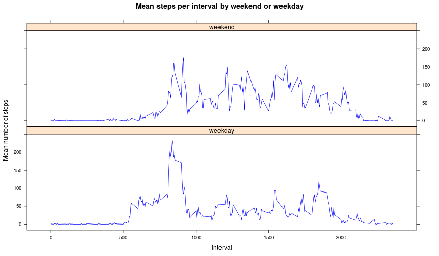

# Reproducible Research: Peer Assessment 1

```r
opts_chunk$set(fig.width=12, fig.height=7)
```

The variables included in this dataset are:
+ steps: Number of steps taking in a 5-minute interval (missing values are coded as NA) - integer
+ date: The date on which the measurement was taken in YYYY-MM-DD format - a factor
+ interval: Identifier for the 5-minute interval in which measurement was taken - integer

The dataset is stored in a comma-separated-value (CSV) file and there are a total of 17,568 observations in this dataset.

## Loading and preprocessing the data

```r
setwd("/media/hadas/OS/Documents and Settings/user/Google Drive/OnlineCourses/R_Data_Science_Specialization/R_Reproducible_research/Assignments/Assignment_1")
data <- read.csv("activity.csv")
data$steps <- as.numeric(data$steps)
```

## What is mean total number of steps taken per day?
### 1. Make a histogram of the total number of steps taken each day

Using the plyr package, I've created a new data frame (DT_sum) that sums the number of steps taken each day.

```r
library(plyr)
DT_sum <- ddply(data, "date", summarise, sum_steps = round(sum(steps),0))
DT_sum <- na.omit(DT_sum)

hist(DT_sum$sum_steps, main = "Histogram of the total number of steps taken each day", xlab = "steps per day", col = "lightskyblue" )
```

 

### 2. Calculate and report the mean and median total number of steps taken per day
The mean and median were calculated based on the DT_sum (the total sum of steps taken each day)

```r
mean_step <- mean(DT_sum$sum_steps)
mean_step
```

```
## [1] 10766
```
The **mean** total number of steps taken is 10766 .

```r
median_step <- median(DT_sum$sum_steps)
median_step
```

```
## [1] 10765
```
The **median** is 10765.

## What is the average daily activity pattern?

### 1. Make a time series plot (i.e. type = "l") of the 5-minute interval (x-axis) and the average number of steps taken, averaged across all days (y-axis)
In order to create the plot, after deleting all NAs, I've created a new data frame DT_inter_mean that contains the mean steps per interval. 

```r
data_rmNA <-  na.omit(data)
DT_inter_mean <- ddply(data_rmNA, "interval", summarise, mean_steps = round(mean(steps),2))
plot (DT_inter_mean$interval, DT_inter_mean$mean_steps, type = "l", main = "5-minute interval mean steps", xlab = "interval", ylab = "steps", col = "blue")
```

 

### 2. Which 5-minute interval, on average across all the days in the dataset, contains the maximum number of steps?
Steps for answering the question:
+ Creating a new vector with the largest number of steps (max_steps)
+ subsetting the data frame according to the row that contains the largest mean number of steps, the output contains the interval variable that corresponds to the largest mean number of steps (largest_inter)

```r
max_steps <- max(DT_inter_mean$mean_steps) 
largest_inter <- DT_inter_mean[DT_inter_mean$mean_steps == max_steps, 1]
largest_inter 
```

```
## [1] 835
```

The 5-minute interval, on average across all the days in the dataset, contains the maximum number of steps is interval 835.

## Imputing missing values

### 1. Calculate and report the total number of missing values in the dataset (i.e. the total number of rows with NAs)
I've summed up the rows with NA in them by using sum() and is.na()


```r
NA_count <- sum(is.na(data$steps)) 
NA_count
```

```
## [1] 2304
```
The total number of rows that contains NAs is 2304.

### 2. Devise a strategy for filling in all of the missing values in the dataset. The strategy does not need to be sophisticated. For example, you could use the mean/median for that day, or the mean for that 5-minute interval, etc.
Here, I've created a new data frame (Ndata) by merging the original data frame with the data frame that contains the mean steps for each interval (the DT_inter_mean data frame). Then I created a new column (cor_steps) in which all NAs were replaced with the mean of the interval and the non NAs are equal to the number of steps. 

```r
Ndata <- merge(data, DT_inter_mean, by.x = 'interval', by.y = 'interval' ) 

Ndata$Cor_step <- with(Ndata, ifelse(!is.na(Ndata$steps),Ndata$steps, Ndata$mean_steps))
```
### 3. Create a new dataset that is equal to the original dataset but with the missing data filled in.
I've creating a new data frame by subsetting the Ndata data frame, taking the $1^{st}$ (interval), $3^{rd}$ (date) and $5^{th}$ (Cor_step) variables.

```r
repNA_DF <- Ndata[ ,c(1, 3, 5)]
```

### 4. Make a histogram of the total number of steps taken each day and Calculate and report the mean and median total number of steps taken per day. Do these values differ from the estimates from the first part of the assignment? What is the impact of imputing missing data on the estimates of the total daily number of steps?

#### An histograpm of the total number of steps taken each day

```r
DT_sum_cor <- ddply(repNA_DF, "date", summarise, sum_cor_steps = round(sum(Cor_step),0))

hist(DT_sum_cor$sum_cor_steps, main = "Histogram of the total number of steps taken each day - NAs substituted by mean of interval", xlab = "steps per day", col = "lightskyblue" )
```

 

#### Calculating and report the mean and median total number of steps taken per day
The mean and median were calculated based on the data frame with the replaced NAs (repNA_DF).

```r
mean_cor_step <- mean(DT_sum_cor$sum_cor_steps)
mean_cor_step
```

```
## [1] 10766
```
When the NAs were replaced with the mean of the corresponding interval, the **mean** total number of steps taken is 10766 .

```r
median_cor_step <- median(DT_sum_cor$sum_cor_steps)
median_cor_step
```

```
## [1] 10766
```
When the NAs were replaced with the mean of the corresponding interval, the **median** total number of steps taken is 10766 .
#### The difference between the mean and median where NAs where ommited and replaced by the mean of the interval and its impact.
The differences between the original mean / median and the corrected mean / median was calculated by subtracting the corrected mean from the original mean.   

```r
mean_diff <- mean_step - mean_cor_step
mean_diff
```

```
## [1] 0.02474
```

```r
median_diff <- median_step - median_cor_step
median_diff
```

```
## [1] -1
```
The difference between the original and the corrected means is 0.0247 and the difference between the original and the corrected median is -1. Thus I can say that the differences between the means and median of sum of steps per day where the NAs were omitted and where there were replaced are negligible. Namely, the impact of imputing missing data on the estimates of the total daily number of steps is negligible.

## Are there differences in activity patterns between weekdays and weekends?

### 1. Create a new factor variable in the dataset with two levels – “weekday” and “weekend” indicating whether a given date is a weekday or weekend day.
Using the weekdays() function that gives the days of the week, I've created a new column in the "data" data frame (the original data frame) with the days of the week. Since the weekend function only works on a date class, I've used the as.Date() in the weekdays function. In order to create the weekend / weekdays factor I've created a new column called "weekday", and by using the ifelse function Sat (Saturdays)  & Sun (Sundays) transformed to a "weekend"  and the rest of the day a "weekday".

```r
data$day <- weekdays(as.Date(data$date), abbreviate = TRUE)
data$weekday <- as.factor(ifelse (data$day == "Sat" |  data$day == "Sun", "weekend", "weekday"))
```

### 2. Make a panel plot containing a time series plot (i.e. type = "l") of the 5-minute interval (x-axis) and the average number of steps taken, averaged across all weekday days or weekend days (y-axis). 
Steps made for generating the plot: 
+ I've created a new data frame that contains no missing values (data_rmNA1).
+ I've split the data frame by weekdays and weekends.
+ Using the plyr package, I've created 2 data frame, one for weekdays (inter_weekday) and one for weekend (inter_weekend), with the mean of interval.
+ I've added a new column (Day_Week) to each of these data frames with wither weekday / weekend.
+ I've combined the two data frame into a new data frame (inter_allWeek) and transformed Day_Week into a factor.
+ Using the lattice package (xyplot), I created the plot.
      + X axis - mean_steps
      + Y axis - interval
      + Factor - Day_Week
      + The xyplot function goes x~y|factor

```r
data_rmNA1 <-  na.omit(data)
data_rmNA1 <- split(data_rmNA1, data_rmNA1$weekday)
inter_weekday<- ddply(data_rmNA1$weekday, "interval", summarise, mean_steps = round(mean(steps),2))
inter_weekday$Day_Week <- "weekday"
inter_weekend<- ddply(data_rmNA1$weekend, "interval", summarise, mean_steps = round(mean(steps),2))
inter_weekend$Day_Week <-  "weekend"
inter_allWeek <- rbind(inter_weekday,inter_weekend)
inter_allWeek$Day_Week <- as.factor(inter_allWeek$Day_Week)

library(lattice)
xyplot(mean_steps~interval|Day_Week, data = inter_allWeek, type = "l", main = "Mean steps per interval by weekend or weekday", xlab = "interval", ylab = "Mean number of steps",col = "blue",  layout = (c(1,2)))
```

 
